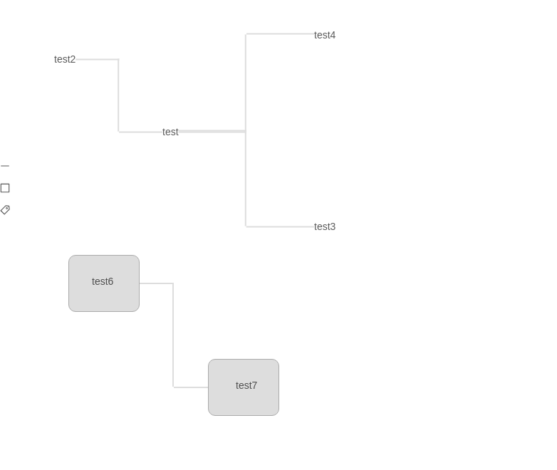

<p align="center">
  </img>
</p>

<div align="center">
  A mini web tool for mind mapping

[](https://codecov.io/gh/orzyyyy/mini-xmind)

<p align="center">
  </img>
</p>

</div>

## Install

```bash
npm install mini-xmind --save-dev
```

## Usage

```javascript
import React, { useState, useEffect } from 'react';
import { Canvas, Toolbar } from 'mini-xmind';

const dataSource = {
  BlockGroup: {
    'block-232930': { x: 54, y: 652 },
    'block-234642': { x: 250, y: 798 },
  },
  LineGroup: {
    'line-446586': {
      fromKey: 'tag-416176',
      toKey: 'tag-443720',
      from: {
        top: 369,
        right: 287.578125,
        bottom: 390,
        left: 265,
        width: 22.578125,
        height: 21,
        x: 265,
        y: 369,
      },
      to: {
        top: 502,
        right: 508.359375,
        bottom: 523,
        left: 478,
        width: 30.359375,
        height: 21,
        x: 478,
        y: 502,
      },
    },
    'line-451979': {
      fromKey: 'tag-439992',
      toKey: 'tag-416176',
      from: {
        top: 267,
        right: 143.359375,
        bottom: 288,
        left: 113,
        width: 30.359375,
        height: 21,
        x: 113,
        y: 267,
      },
      to: {
        top: 369,
        right: 287.578125,
        bottom: 390,
        left: 265,
        width: 22.578125,
        height: 21,
        x: 265,
        y: 369,
      },
    },
    'line-479893': {
      fromKey: 'tag-476280',
      toKey: 'tag-416176',
      from: {
        top: 240,
        right: 494.359375,
        bottom: 261,
        left: 464,
        width: 30.359375,
        height: 21,
        x: 464,
        y: 240,
      },
      to: {
        top: 369,
        right: 287.578125,
        bottom: 390,
        left: 265,
        width: 22.578125,
        height: 21,
        x: 265,
        y: 369,
      },
    },
    'line-493906': {
      fromKey: 'tag-491320',
      toKey: 'tag-443720',
      from: {
        top: 591,
        right: 600.359375,
        bottom: 612,
        left: 570,
        width: 30.359375,
        height: 21,
        x: 570,
        y: 591,
      },
      to: {
        top: 502,
        right: 508.359375,
        bottom: 523,
        left: 478,
        width: 30.359375,
        height: 21,
        x: 478,
        y: 502,
      },
    },
    'line-335318': {
      fromKey: 'block-232930',
      toKey: 'block-234642',
      from: {
        top: 552,
        right: 233,
        bottom: 632,
        left: 133,
        width: 100,
        height: 80,
        x: 133,
        y: 552,
      },
      to: {
        top: 698,
        right: 429,
        bottom: 778,
        left: 329,
        width: 100,
        height: 80,
        x: 329,
        y: 698,
      },
    },
  },
  TagGroup: {
    'tag-416176': { x: 186, y: 469, editable: false, input: 'test' },
    'tag-439992': { x: 34, y: 367, editable: false, input: 'test2' },
    'tag-443720': { x: 399, y: 602, editable: false, input: 'test3' },
    'tag-476280': { x: 385, y: 340, editable: false, input: 'test4' },
    'tag-491320': { x: 491, y: 691, editable: false, input: 'test5' },
    'tag-240426': { x: 89, y: 685, editable: false, input: 'test6' },
    'tag-248450': { x: 284, y: 829, editable: false, input: 'test7' },
  },
  CanvasPosition: { x: 79, y: -100, z: 0, gap: 1 },
};

export default () => {
  const [data, setData] = useState({});

  useEffect(() => {
    setData(dataSource);
  }, []);

  const onChange = newData => {
    setData(newData);
  };

  return (
    <>
      <Toolbar />
      <Canvas className="canvas-wrapper" data={data} onChange={onChange} />
    </>
  );
};
```

## Development

```bash
$ git clone https://github.com/orzyyyy/mini-xmind.git
$ cd mini-xmind
$ npm install
$ npm start
```

Open your browser and visit <http://localhost:9099>

## Test Case

```
npm test
```

## API

### Toolbar props

No prop for now, just render

### Canvas props

| Property    | Description                                         | Type                                                                                                                                               | Default   |
| ----------- | --------------------------------------------------- | -------------------------------------------------------------------------------------------------------------------------------------------------- | --------- |
| data        | what you want to paint in canvas                    | [DataSource](https://github.com/orzyyyy/mini-xmind/blob/0b83c704edf98fac54dc5117f120565b28244877/src/canvas/core.tsx#L23)                          | {}        |
| onChange    | return all data when dragging or typing in TagGroup | (dataCollector: [DataSource](https://github.com/orzyyyy/mini-xmind/blob/0b83c704edf98fac54dc5117f120565b28244877/src/canvas/core.tsx#L23)) => void | -         |
| orientation | the direction of Line startting                     | enum, ['horizonal', 'vertical']                                                                                                                    | horizonal |
